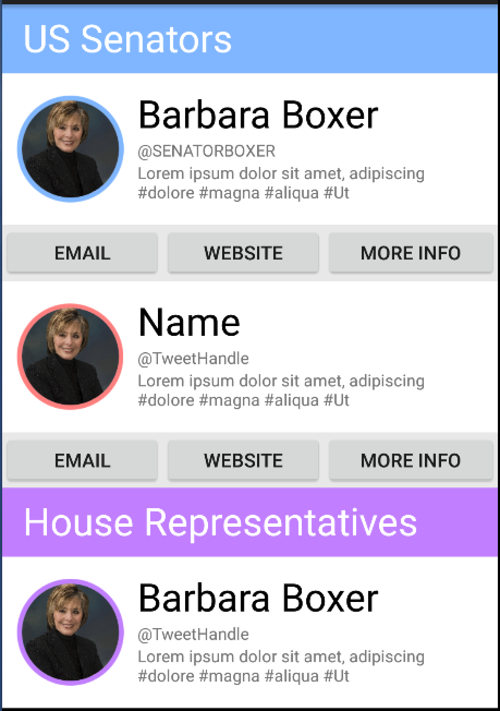
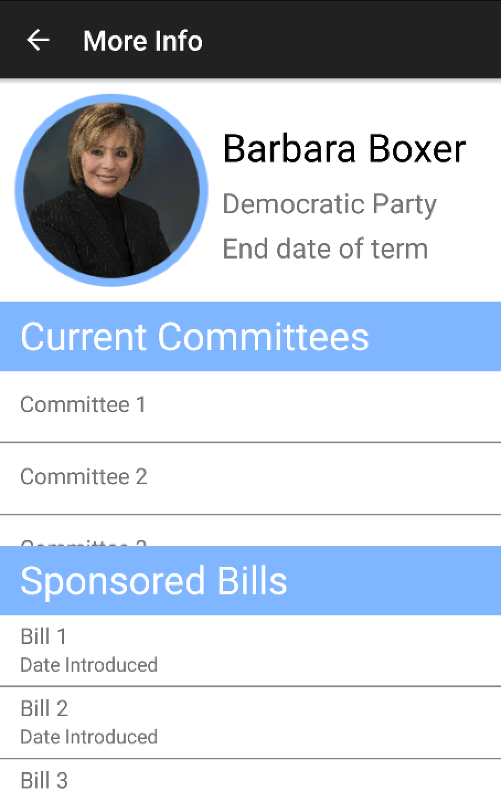
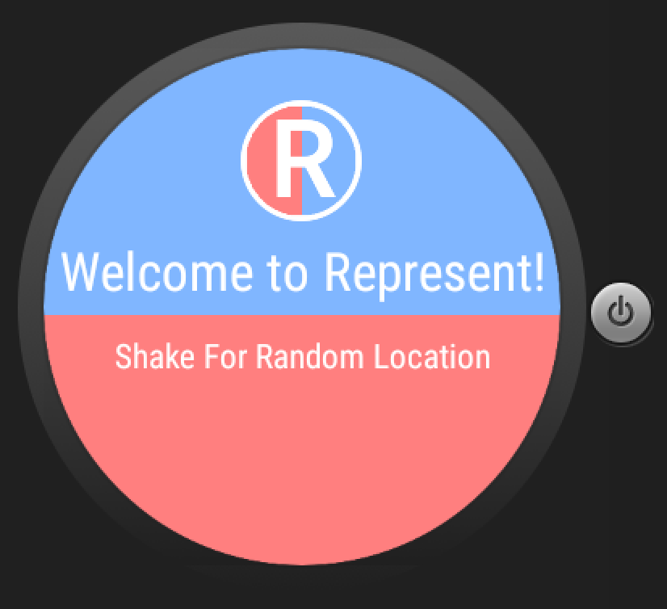
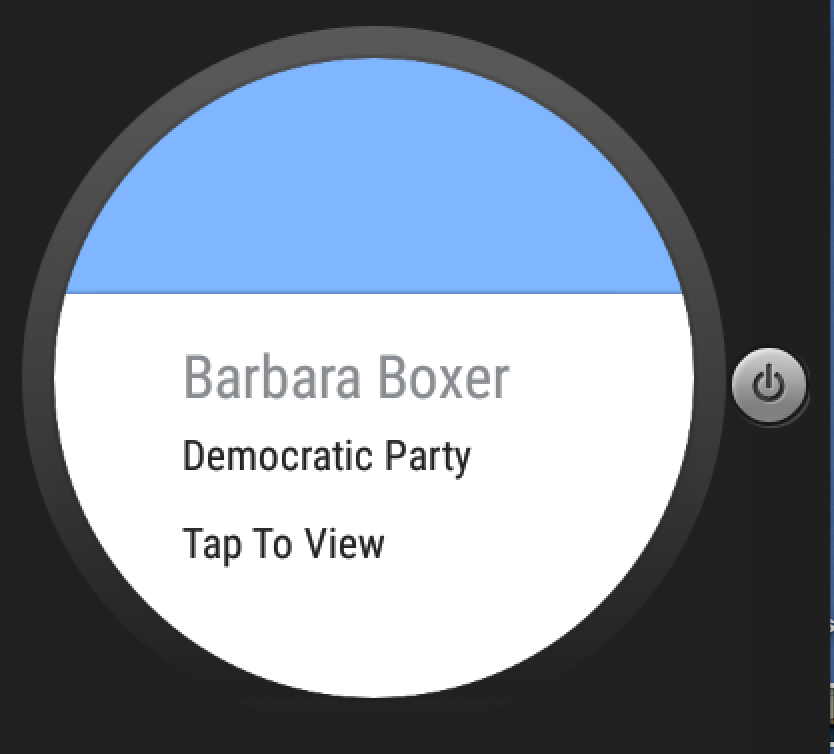
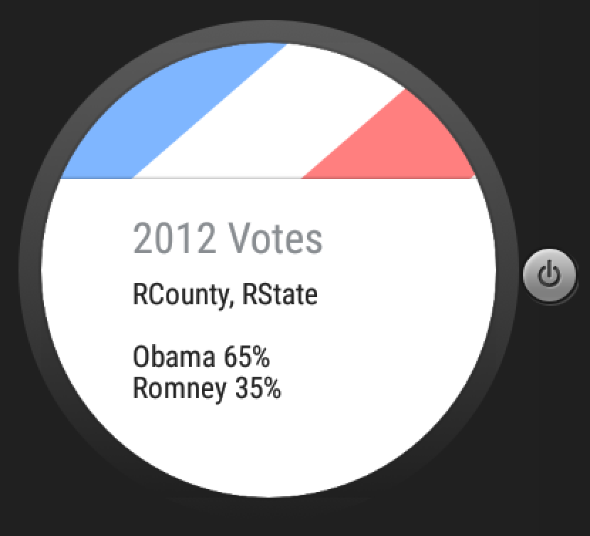

# PROG 02: Represent!

First draft of my Represent! app that lets you view information for representatives from different areas. It allows you to enter your ZIP code, use current location or shake for a random location to view the two US Senators and one or two House Representatives for that area. This app supports watch and phone communication to show different views of the represenattives info.

## Authors

Annalise Hurst ([anhurst@berkeley.edu](mailto:anhurst@berkeley.edu))

## Demo Video

See [Represent!] (https://youtu.be/UC58QB38LTE)

## Screenshots

## Acknowledgments

TA's Catnip skeleton code for phone to watch and watch to phone functionallity.
How I set up shake functionality http://code.tutsplus.com/tutorials/using-the-accelerometer-on-android--mobile-22125. 
How I set up 2D picker http://www.sprima.com/blog/?p=144.
Page Dots http://stackoverflow.com/questions/26247343/how-to-add-page-dots-for-2d-pickers-in-android-wear.

