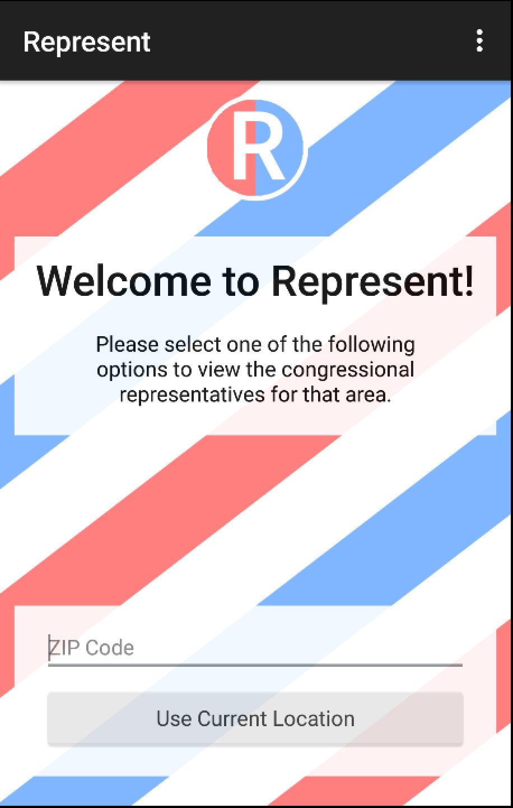
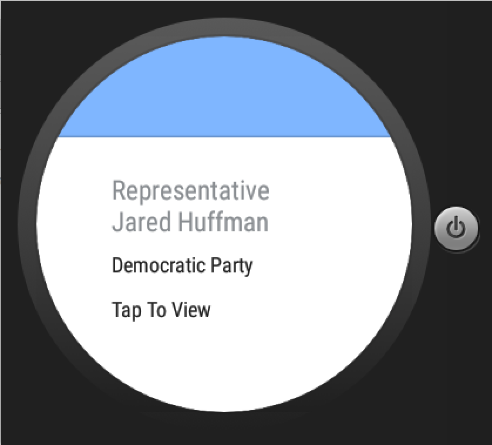
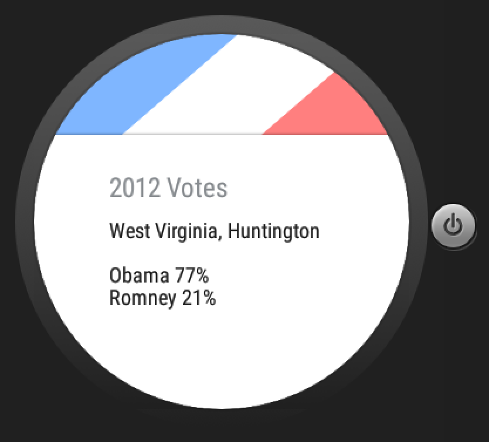
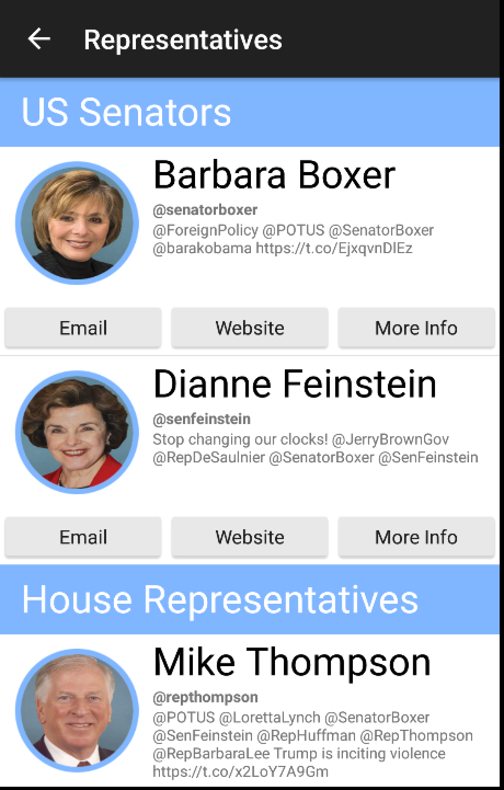
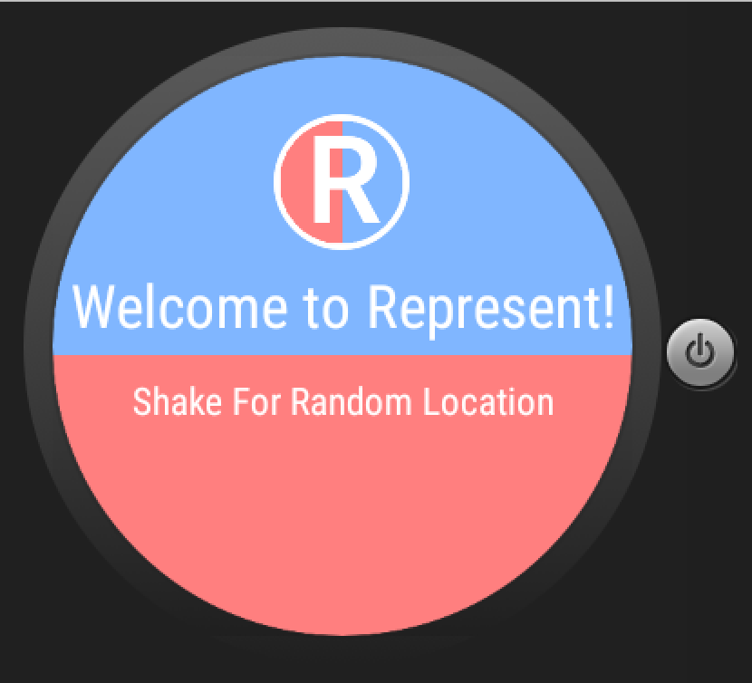

# PROG 02: Represent!

First draft of my Represent! app that lets you view information for representatives from different areas. It allows you to enter your ZIP code, use current location or shake for a random location to view the two US Senators and one or two House Representatives for that area. This app supports watch and phone communication to show different views of the represenattives info.
Method 1 - Shaking for random location on the wearable device.
After you shake your wearable device the phone screen will 	update to show a 2D picker view of the representatives for that random location. In this case the first representative shown  in the view is Representative Evan Jenkins. At the end of the 2D picker list there will be a 2012 Presidential Votes page that shows the percentage of votes for Obama and Romney for the corresponding location as the representatives. On the phone view the list of representatives for that area will also be displayed in a scrollable view. With the two US Senators at the top and the one or two House Representatives beneath them. 

Method 2 & 3 - Entering a ZIP code or selecting Use Current Location on the phone.
After you input a ZIP code or click the Use Current Location button, the phone screen will update to show a the same representatives scrolling view as before but with the representatives corresponding to either the ZIP code you entered or your current location. The wearable device will also show a new 2D picker view of the representatives for that same location. In this case the first representative shown in the view is Representative Mike Thompson. At the end of the 2D picker list there again will be a 2012 Presidential Votes for the corresponding location as the representatives. On the phone view the list of representatives for that area will also be displayed in a scrollable view. This view was gotten by entering a ZIP code that has two House Representatives. Both are shown in the Representatives view. 

Details -
In the representatives view for each representative their name, picture, most recent tweet, and link to email and website are shown. Their party is indicated by the color of their image frame. They also have a More Info button that takes the user to the detailed view.
There are two ways that you can reach the more detailed view for a representative. One is by taping on the 2D picker card for that representative on the watch, and the other is by clicking the More Info button for that representative in the Representatives view on the phone. In the More Info page the representatives name, image, party, end of term date, current committees, and sponsored bills are displayed. You can scroll through the list of both current committees and sponsored bills.

Design Changes - 
Many of my design changes were made to better fit the text that was received from the APIs. In my original design I underestimated the length of many of data values, including the representatives names, their tweets, and their bill and committee names.
To fix this problem I made some text sizes smaller and enlarged some of the text fields accordingly.
On the Representatives page I also changed the style of the twitter handle to bold to make it stand out against the rest of the tweet and got rid of the border on the buttons and changed the style of the text to give the view a lighter more simplistic look.

## Authors

Annalise Hurst ([anhurst@berkeley.edu](mailto:anhurst@berkeley.edu))

## Demo Video

See [Represent!] (https://youtu.be/UC58QB38LTE)

## Screenshots

## Acknowledgments

TA's Catnip skeleton code for phone to watch and watch to phone functionallity.
How I set up shake functionality http://code.tutsplus.com/tutorials/using-the-accelerometer-on-android--mobile-22125. 
How I set up 2D picker http://www.sprima.com/blog/?p=144.
Page Dots http://stackoverflow.com/questions/26247343/how-to-add-page-dots-for-2d-pickers-in-android-wear.

